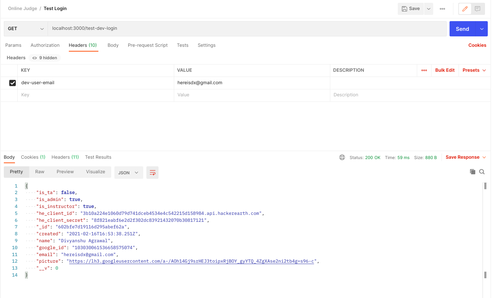

## Online Judge Server

Heroku URL: https://bits-judge.herokuapp.com/

## Setup

- Install Node.JS from https://github.com/nvm-sh/nvm
- Install Git from https://git-scm.com
- Open this project folder in a terminal
- Run `npm install`
- Run `npm i -g eslint`
- Run `npm i -g nodemon`
- Install Postman from https://postman.com

## Run

- In a terminal, execure `npm run dev` to launch a hot-reloading server.

## Testing endpoints

- To log in in Postman, set a Header with key `dev-user-email` and value as the `email` of the user you want to be logged in as.

## Deployment

- Install the Heroku CLI.
- Commit any changes.
- Run `git push heroku`. ( You'll need access first )

## HackerEarth Demo

http://p.ip.fi/2-A0
